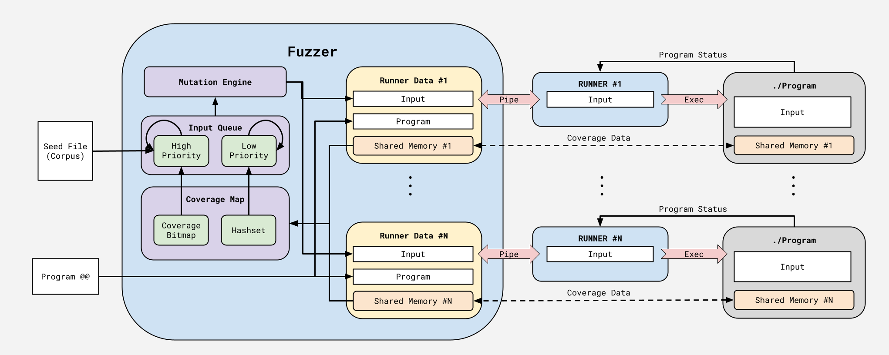

# Homework 4 Coverage-Guided Fuzzer - CSE 320 - Spring 2026
#### Professor Dan Benz

### **Due Date: Sunday April 19th at 23:59 (11:59 pm)**

## Introduction

The goal of this assignment is to become familiar with low-level Unix/POSIX system
calls related to processes, various inter-process communications (IPC), signal
handling, files, and I/O redirection. You will implement a coverage-guided fuzzer 
program called `fuzzer`. A fuzzer is an automated software testing tool that attempts
to inject inputs to another program in an attempt to crash it. A coverage-guided
fuzzer keeps track of how the program behaves when supplied an input and uses this
information to generate/mutate inputs which will be more likely to trigger a crash.
The user will provide a seed file containing the initial inputs to test the program
and a set number of additional generated inputs to test the supplied program with.

### Takeaways

After completing this assignment, you should:

* Understand process execution: forking, executing, and reaping.
* Understand various IPCs and their different uses: pipe, signals, and shared memory.
* Understand signal handling.
* Understand the use of "dup" to perform I/O redirection.
* Have gained experience with C libraries and system calls.
* Have enhanced your C programming abilities.

## Hints and Tips

* We **strongly recommend** that you check the return codes of **all** system calls
  and library functions.  This will help you catch errors.
* **BEAT UP YOUR OWN CODE!** Exercise your code thoroughly with various numbers of
  processes and timing situations, to make sure that no sequence of events can occur
  that can crash the program.
* Your code should **NEVER** crash, and we will deduct points every time your
  program crashes during grading. Especially make sure that you have avoided
  race conditions involving process termination and reaping that might result
  in "flaky" behavior.  If you notice odd behavior you don't understand:
  **INVESTIGATE**.
* **READ THE ENTIRE ASSIGNMENT DOCUMENT BEFORE BEGINNING**. A lot of the information
  presented here is going to be new. Additionally, the architecture of the program 
  is complex. Therefore, you should only begin if you completely understand how the
  program should behave. This may require rereading the document multiple times. If
  you still have any questions, do not hesitate to reach out on Piazza or during
  office hours.

> :nerd_face: When writing your program, try to comment as much as possible and stay
> consistent with code formatting.  Keep your code organized, and don't be afraid
> to introduce new source files if/when appropriate.

### Reading Man Pages

This assignment will involve the use of many system calls and library functions
that you probably haven't used before. As such, it is important that you become 
comfortable looking up function specifications using the `man` command.

The `man` command stands for "manual" and takes the name of a function or command
(programs) as an argument. For example, if I didn't know how the `fork(2)` system 
call worked, I would type `man fork` into my terminal. This would bring up the manual 
for the `fork(2)` system call.

> :nerd_face: Navigating through a man page once it is open can be weird if you're not
> familiar with these types of applications.
> To scroll up and down, you simply use the **up arrow key** and **down arrow key**
> or **j** and **k**, respectively.
> To exit the page, simply type **q**.
> That having been said, long `man` pages may look like a wall of text.
> So it's useful to be able to search through a page.
> This can be done by typing the **/** key, followed by your search phrase,
> and then hitting **enter**.
> Note that man pages are displayed with a program known as `less`.
> For more information about navigating the `man` pages with `less`,
> run `man less` in your terminal.

Now, you may have noticed the `2` in `fork(2)`. This indicates the section in which the 
`man` page for `fork(2)` resides. Here is a list of the `man` page sections and what 
they are for.

| Section          | Contents                                |
| ----------------:|:--------------------------------------- |
| 1                | User Commands (Programs)                |
| 2                | System Calls                            |
| 3                | C Library Functions                     |
| 4                | Devices and Special Files               |
| 5                | File Formats and Conventions            |
| 6                | Games et. al                            |
| 7                | Miscellanea                             |
| 8                | System Administration Tools and Daemons |

From the table above, we can see that `fork(2)` belongs to the system call section
of the `man` pages. This is important because there are functions like `printf` which 
have multiple entries in different sections of the `man` pages. If you type `man printf` 
into your terminal, the `man` program will start looking for that name starting from 
section 1. If it can't find it, it'll go to section 2, then section 3 and so on.
However, there is actually a Bash user command called `printf`, so instead of getting
the `man` page for the `printf(3)` function which is located in `stdio.h`, we get the 
`man` page for the Bash user command `printf(1)`. If you specifically wanted the function 
from section 3 of the `man` pages, you would enter `man 3 printf` into your terminal.

> :scream: Remember this: **`man` pages are your bread and butter**.
> Without them, you will have a very difficult time with this assignment.

## Technical Background

The information presented here serves as a high-level background to help you understand
this assignment. Additional more technical information are added within the block quotes 
for if you are curious.

### Fuzzing

A fuzzer is an automated software testing tool which attempts to generate inputs which
will cause a program to crash. The usage of a fuzzer is called fuzzing. Crashes
in a program typically indicate bugs or even software vulnerabilities that an attacker
may exploit. Compiling code with sanitizers such as AddressSanitizer (ASan),
MemorySanitizer (MSan), UndefinedBehaviorSanitizer (UBSan) etc., has allowed fuzzers 
to catch even more software bugs by intentionally causing crashes when the sanitizer 
detects a bug. To demonstrate how effective fuzzers are, as of May 2025, Google's 
OSS-Fuzz project has claimed to have identified and fixed over 13,000 vulnerabilities 
and 50,000 bugs across 1,000 projects. 

> :nerd_face: The first fuzzer originated in 1988 as a class project for an graduate
> Operating Systems class at the University of Wisconsin. In 1990, the results
> of the fuzzer was published in a paper. In this paper, it was revealed that
> Miller's team was able to crash 25 to 33 percent of the UNIX command line
> programs they have tested. Since then, fuzzing has become widely adopted to
> test software for bugs and software vulnerabilities. Since then, fuzzing has
> expanded to target more than programs, and it has been applied to even 
> operating systems (see Google's syzkaller).
> 
> Source: https://en.wikipedia.org/wiki/Fuzzing

One way of categorizing sanitizers is between black-box fuzzing, white-box fuzzing,
and finally grey-box fuzzing. Black-box fuzzing involves fuzzing a program without
any information on the program source code, hence the program is a black box. In
contrast, white-box fuzzing requires access to the source code of a program to perform
complex static and dynamic analysis or constraint solving to discover inputs which may 
cause the program to crash. Finally, grey-box fuzzing is a middle-ground between 
black-box and white-box fuzzing where we have access to the program source code, 
but we do not perform such intensive analysis as required for black-box fuzzing.

The specific grey-box fuzzer you will be implementing in this assignment is a 
coverage-feedback guided fuzzer. A coverage-guided fuzzer leverages
coverage data to learn how to reach deeper into a program. The coverage data of
a program is the control flow path that the input has caused the program to
take. The goal of a coverage-feedback guided fuzzer is to attempt to explore
as many different paths of the target program in hope of finding crashes. The 
fuzzer you will implement will also be mutation-based meaning the fuzzer will
generate new inputs by slightly modifying existing inputs. 

> :nerd_face: The coverage-feedback data can be defined more precisely. Given a program,
> there is a control flow graph (CFG). In a control flow graph, the nodes are called
> basic blocks and once the control flow enters a basic block, all instructions within
> the basic block has to be executed, i.e., a basic block is all instructions up to the
> first jump or branch instruction. The edges represent the control flow between them.
> Thus, the coverage-feedback data is the walk of the CFG that a program takes when
> supplied with an input. 

### Compiler Toolchains

Up until this point in this course, we have been describing compilers as a tool used
solely to translate source code into machine code. However, compilers are much more
powerful and useful than that, and industry-standard compilers come with a wide array
of additional tools for a developer. In this assignment, we will be exploring some
of these additional features.

Unlike the prior assignments, we will be using LLVM's `clang` instead of `GNU` `gcc`.
LLVM is an open-source project provide reusable compiler and toolchain technologies
which have been widely used in practice as well as in academic research. `clang` is
LLVM's `C` compiler. One of the key features used in this project that we will 
describe here unfortunately is only supported by `clang`. Fortunately, it is simple
to install `clang` via a package manager on a modern day Linux operating system.

As mentioned previously, `clang` comes with many sanitizers which can detect memory
and software bugs. One such sanitizer is AddressSanitizer (ASan) which catches bugs
such as out-of-bounds accesses to variables, use-after-free, double free, and more.
This sanitizer is enabled by the `-fsanitize=address` flag. Another sanitizer is
MemorySanitizer (MSan) which catches bugs such as using an uninitialized variable
in a conditional branch, uninitialized pointer is used for memory accesses, etc.
This is enabled with the `-fsanitize=memory` bug. Finally, there is 
UndefinedBehaviorSanitizer (UBSan) which detects undefined behavior such as 
signed integer overflow, out-of-bound bitshifts, etc. This is enabled using the
`-fsanitize=undefined` flag. We will be using these sanitizers to cause a program
to crash when it encounters these bugs which will be caught by the fuzzer.

> :nerd_face: Compilers implement sanitizers by instrumenting your code. This typically
> involves adding additional runtime checks in your code, storing additional metadata
> for memory locations, and more. Since the compiler has access to your source code
> during its translation to machine code, it can modify your code in the final 
> compiled binary. These additional checks also are why enabling sanitizers can cause
> a program to run even slower. 
>
> As a note, GCC supports ASan and UBsan. However, it does not support MSan.

Finally, to obtain the coverage data for the fuzzer, we will also use a coverage-sanitizer
which will insert function calls at every edge of the control flow graph. We can supply
our own custom implementation of these function calls to obtain the coverage data. To
enable the edge coverage sanitizer, we use the flag `-fsanitize-coverage=trace-pc-guard`.

## Getting Started

Here is the structure of the base code:
<pre>
.
├── Makefile
├── README.md
├── include
│   ├── coverage_map.h
│   ├── debug.h
│   ├── fuzzer.h
│   ├── global.h
│   ├── input.h
│   ├── input_queue.h
│   ├── mutator.h
│   └── runner.h
├── lib
│   ├── fzl.a
│   └── fzl_event.h
├── programs
│   ├── Makefile
│   ├── Makefile.variables
│   ├── README.md
│   ├── Template.mk
|   ├── coverage.c
│   ├── cascade
│   │   ├── Makefile
│   │   ├── build
│   │   │   ├── cascade.d
│   │   │   └── cascade.o
│   │   └── cascade.c
│   └── hello-world
│       ├── Makefile
│       ├── include
│       │   └── hello.h
│       └── src
│           ├── hello.c
│           └── main.c
├── src
│   └── main.c
└── test
    └── fuzzer_tests.c
</pre>

* The `Makefile` is a configuration file for the `make` build utility, which is what
  you should use to compile your code.  In brief, `make` or `make all` will compile
  anything that needs to be, `make debug` does the same except that it compiles the code
  with options suitable for debugging, and `make clean` removes files that resulted from
  a previous compilation.  These "targets" can be combined; for example, you would use
  `make clean debug` to ensure a complete clean and rebuild of everything for debugging.

* The `include` directory contains C header files (with extension `.h`) that are used
  by the code.  We do not recommend modifying them because if the base definitions are 
  modified, it will likely result in an error during testing.

* The `lib` directory contains an archive file `fzl.a` which contains the implementation
  for the fuzzer logger to be used in the implementation.

* The `programs` directory contains test programs which should be used to test the fuzzer
  implementation. It also contains a mechanism to creating and building new programs 
  efficiently. All programs here are compiled and linked with the coverage sanitizers.

* The `src` directory contains C source files (with extension `.c`).

* The `test` directory contains C source code (and sometimes headers and other files)
  that are used by the Criterion tests.

## `fuzzer`: Functional Specification

### Preliminary

As stated previously, we will be used LLVM and the `clang` compiler for this assignment.
Thus, make sure you have installed the following packages:

* `clang`
* `libclang-rt-18-dev`

After installing these packages, you should be able to use `clang` and have the headers
necessary for the coverage sanitizer in `clang`.

### Program Operation and Argument Validation

Your program will be a command line utility which when invoked will begin fuzzing a target
program with supplied and generated inputs. The specific usage scenarios for your program
are as follows:

```
Usage: ./bin/fuzzer [options] PROGRAM ARGS...
Options:
  -h                    Print this help message
  -j jobs               Number of jobs used for fuzzing. Default is 4
  -n inputs             Total number of inputs to attempt. Default is 32
  -s seed_file          Input file containing newline-separated initial inputs to the fuzzer. REQUIRED
  -t time_limit         Set the time limit for the target program in seconds. Default is 5
```

> :scream: A `PRINT_USAGE` macro has already been provided for you in the `global.h`
> header file.  You should use this macro to print the help message.

To make the fuzzer more efficient, the fuzzer will be executing the target programs simultaneously using 
different inputs. This will be accomplished by using child processes via `fork` and `execvp`. The number
of jobs that the fuzzers will use is specified via the `-j` flag. Jobs will be explained in a later section.

The fuzzer also requires an initial set of inputs called the input seed. This is specified using the `-s` 
flag. This is a required flag, and it is an error if it is omitted. 

Traditionally, fuzzers run continuously until a user prompts the fuzzer to stop. However, in this assignment,
the fuzzer will have a limit on the number of inputs it will test before exiting. The `-n` flag specifies
this number of inputs. The number of inputs to test does not include the inputs to test from the seed
inputs.

Some programs may not halt. If so, this may cause a job to stall indefinitely and may eventually cause the
fuzzer to not make any forward progress. To avoid this, the fuzzer will implement a time limit on the
target program, and it will terminate the program if it exceeds this time limit. This time limit is
specified using the `-t` flag. The unit of the time limit is in seconds.

`PROGRAM` is the target program to be fuzzed. This program must be compiled and linked with the coverage 
sanitizer (See `programs` directory for such programs and how to write your own). `ARGS...` is a list of
arguments that will be supplied to the target program. At most one of the arguments in `ARGS...` must be
`@@` which will be a placeholder which the fuzzer will replace with the input it wants to test.  

If the option `-h` is set at any point, the program should write its help message to standard out and
exit with `EXIT_SUCCESS`.

At this point, you should be familiar with implementing code to parse the arguments to the fuzzer. One
nuance for when you implement the code for this project, however, is that your implementation should
start with interpreting arguments as options to the fuzzer. This continues until the program cannot
match the argument to an option. At this point, all arguments are parsed as the target program and
the arguments to the target program. For example:

```
> ./bin/fuzzer -s inputs.txt ./programs/bin/cascade @@
    Options: (-s inputs.txt)
    Target Program: ./programs/bin/cascade
    Target Program Arguments: @@

> ./bin/fuzzer -j 10 -n 100 -s hello world -t 50 @@
    Options: (-j, 10), (-n, 100), (-s, hello)
    Target Program: world
    Target Program Arguments: -t 50 @@

> ./bin/fuzzer -s inputs.txt -z -n 100 ./programs/bin/cascade @@
    Options: (-s inputs.txt)
    Target Program: -z
    Target Program Arguments: -n 100 ./program/bin/cascade @@
```

After any error during the parse the fuzzer program arguments, the program should write the help message
to standard error and exit with `EXIT_FAILURE`. 

### High-Level Program Overview

This section will highlight the different components which need to be implemented for the fuzzer.
Additionally, it will describe how the components interact with each other and how the final
program will behave. The goal of this section is to provide a high-level understanding of the project 
before delving deeper into the specifics of each components. 

The core components to the fuzzer are:

* Main Fuzzer
* Input Queue
* Mutation Engine
* Runner Jobs
* Coverage Map
* Event Logger

The **Input Queue** is precisely what its name suggests. The user can enqueue and dequeue inputs
as necessary. It is where the fuzzer will store inputs which it considers "interesting". These 
inputs are ones where the fuzzer would like to mutate and then pass onto a runner to execute. 
The input queue will include the initial set of inputs provided by the seed file.

The **Mutation Engine** is the component which is responsible for converting one input to another
using some method. The specifics of mutation engine you will implement will be described in greater
detail later. The general path that an input takes is that it is first dequeued from the input queue.
Next, it is passed into the mutation engine which will create a new input. This input will
then be passed onto a runner. 

The **Runner Job** is the component which is responsible for running the target program with the
input it is supplied. It will either run the program and then wait for the target program to terminate
or terminate it itself if the program's time limit is exceeded. Finally, the runner job is responsible
for sending the **Main Fuzzer** the results and notify that it is once again ready for another input.

The **Coverage Map** is the component which will utilize the coverage-feedback data it is obtained from
running the program. If the input did not lead to a crash or a time-out, then the coverage-feedback data
is used to determine if the input has lead to a novel program execution path. If so, the fuzzer will 
add it to the input queue. Otherwise, the input is discarded. This allows the fuzzer to filter inputs
and avoid duplicates from filling up the input queue.

The **Main Fuzzer** is the component which utilizes the other components to build the core logic for
the fuzzer. It is responsible for reading the initial inputs from the seed file and inserting them
into the input queue. It is also responsible for dequeueing inputs and passing it through the
fuzzer. Next, it will pass mutated inputs to the runners. Once it has been alerted that a runner
has completed, it will determine if the results of running the program means that the input should
be added into the input queue via the coverage map.

Finally, the **Event Logger** is a component which you will not be implementing. Instead this component
is a list of functions which will be used to facilitate the testing and to verify if your implemented
fuzzer works correctly. You will be responsible for calling the adequate function at certain points
in your program which will be described in a later section.

Included below is an image showing a model of the system and the interactions between components. Be sure
to refer back to this image frequently.



### Input Queue

The input queue component operates on inputs. The interface for inputs is declared in
`input.h`.

```C
typedef uint64_t MUTATOR_STATE;
typedef struct input * INPUT;

INPUT make_input(const char *input_str);
void free_input(INPUT input);
size_t input_len(INPUT input);
const char *input_str(INPUT input);
MUTATOR_STATE input_mutator_state(INPUT input);
MUTATOR_STATE input_set_state(INPUT input, MUTATOR_STATE state);
MUTATOR_STATE input_state_step(INPUT input);
```

Inputs are represented using the `INPUT` type. The `INPUT` type, in addition to storing
a string for the input, should have a data member `MUTATOR_STATE` representing the
current state for the mutator the input is in. The mutator state will be explained more
thoroughly in the mutation engine section.

> :nerd_face: I would recommend to implement INPUT as an opaque pointer. Opaque pointers
> are pointer which point to a data structure whose representation is unknown at the time
> of its definition. This means that you cannot access its data members either via `->` and
> you cannot dereference it. The benefit of opaque pointers is that it enables better
> modularization of code by encapsulating the data stored in the data structure.
>
> To use the opaque pointer, the definition of `struct input` should be kept in its
> own C file. Within this C file, you will implement all functions which require access
> to the data stored at the pointer. This mean that within this file, you can dereference
> the pointer and access data members via `->`. However, outside of this translation unit,
> code can only manipulate the data at the pointer via the API.
>
> An opaque pointer is created by using a `typedef` defining a type as the pointer to some
> undefined struct.

The following operations are supported for `INPUT`:

- The `make_input` function creates an `INPUT` object using the provided string and returns
  it back to the caller. This sets the mutation state to zero.

- The `free_input` function destroys an `INPUT` object created by `make_input`. It released
  or deallocates any resource or memory from `make_input`.

- The `input_len` function returns the length of the input stored in the `INPUT` object

- The `input_str` function returns a reference to the string stored in the `INPUT` object

- The `input_mutator_state` function returns the current `MUTATOR_STATE` of the `INPUT` object

- The `input_set_state` function sets the `MUTATOR_STATE` of the `INPUT` object

- The `input_state_step` function increments the `MUTATOR_STATE` of the `INPUT` object

The functions you are to implement for the input queue can be found in `input_queue.h`

```C
typedef struct input_queue * INPUT_QUEUE;

INPUT_QUEUE input_queue_init();
void input_queue_fini(INPUT_QUEUE queue);
void enqueue_high_prio_input(INPUT_QUEUE queue, INPUT input);
void enqueue_low_prio_input(INPUT_QUEUE queue, INPUT input);
INPUT dequeue_input(INPUT_QUEUE queue);
```

The input queue component is actually composed of two queues: a queue for high priority
inputs and another for low priority inputs. The difference between a high priority input
and a low priority input is explained in the section on the coverage map component. 
The `INPUT_QUEUE` type encapsulates both of these queues and the functions above
describe operations which can be performed on `INPUT_QUEUE`. Additionally, there is
the additional condition that there cannot be duplicate inputs within a queue. 

- The `input_queue_init` function is responsible for initializing an `INPUT_QUEUE` and
  returning it back to the caller to use. This involves initializing both the high
  priority queue and the low priority queue. 

- The `input_queue_fini` function is responsible for destroying an `INPUT_QUEUE`. This
  involves releasing any resource or memory that was acquired or allocated by 
  `init_queue_init`. It must also release any resource or memory stored within its
  data structure. 

- The `enqueue_high_prio_input` function enqueues an `INPUT` object into the high
  priority input queue if the input is not already in any queue.

- The `enqueue_low_prio_input` function enqueues an `INPUT` object into the low
  priority input queue if the input is not already in any queue.

- The `dequeue_input` function dequeues from either the high priority queue or the
  low priority queue based on a pattern. The pattern you will be using is nine
  high priority inputs before a single low priority input. This pattern repeats.
  Next, the function will re-enqueue the dequeued input. Finally, it will return a
  reference to the input back to the caller, i.e., do not return a copy to the caller.

These functions serve as the interface for manipulating the input queue component. 

### Mutation Engine

The interface for the mutation engine is found in `mutator.h` and it simply is:

```C
INPUT mutate(INPUT input);
```

The `mutate` function accepts an input and performs a mutation on it based on its
`MUTATOR_STATE` value. The function then increments the mutation state of the
argument input and returns the mutated input to the caller. The different mutation
methods are described in great detail in the the `Mutation.md` file. The `mutate`
function will cycle between $37$ different mutations. The specific mutation
strategy chosen by `mutate` is $S\mod 37$ where $S$ is the `MUTATOR_STATE` value.
The order of the mutation in the cycle is described below:

1. Inject Random Substring of Length $1$ [Strategy 7 with $L=1$]
2. Inject String "0" [Strategy 5 with $A=\text{``0''}$]
3. Lengthen String By $4$ Characters [Strategy 3 with $L=4$]
4. Inject String "1" [Strategy 5 with $A=\text{``1''}$]
5. Inject Chracter '/' [Strategy 8 with $C=\text{`/'}$]
6. Lengthen String By $7$ Characters [Strategy 3 with $L=7$]
7. Flip $1$ Bits [Strategy 9 with $L=1$]
8. Decrement Bytes [Strategy 11]
9. Duplicate Input [Strategy 2]
10. Lengthen String by $1$ Characters [Strategy 3 with $L=1$]
11. Inject String "-128" [Strategy 5 with $A=\text{``-128''}$]
12. Lengthen String by $8$ Characters [Strategy 3 with $L=8$]
13. Inject String "2147483647" [Strategy 5 with $A=\text{``2147483647''}$]
14. Flip $4$ Bits [Strategy 9 with $L=4$]
15. Inject String "-1" [Strategy 5 with $A=\text{``-1''}$]
16. Lengthen String by $2$ Characters [Strategy 3 with $L=2$]
17. Inject String "32767" [Strategy 5 with $A=\text{``32767''}$]
18. Fill With Single Character To Length [Strategy 1]
19. Inject Random Substring of Length $2$ [Strategy 7 with $L=2$]
20. Inject Chracter '.' [Strategy 8 with $C=\text{`.'}$]
21. Lengthen String By $3$ Characters [Strategy 3 with $L=3$]
22. Inject String "%p" [Strategy 5 with $A=\text{``\%p''}$]
23. Truncate Input [Strategy 4]
24. Inject Random Integer String [Strategy 6]
25. Inject String "127" [Strategy 5 with $A=\text{``127''}$]
26. Inject Chracter ';' [Strategy 8 with $C=\text{`;'}$]
27. Lengthen String By $5$ Characters [Strategy 3 with $L=5$]
28. Inject String "-32768" [Strategy 5 with $A=\text{``-32768''}$]
29. Increment Bytes [Strategy 10]
30. Inject String "%s" [Strategy 5 with $A=\text{``\%s''}$]
31. Inject Random Substring of Length $8$ [Strategy 7 with $L=8$]
32. Flip $8$ Bits [Strategy 9 with $L=8$]
33. Inject String "-2147483648" [Strategy 5 with $A=\text{``-2147483648''}$]
34. Inject Chracter ',' [Strategy 8 with $C=\text{`,'}$]
35. Lengthen String By $6$ Characters [Strategy 3 with $L=6$]
36. Inject Random Substring of Length $4$ [Strategy 7 with $L=4$]
37. Flip $2$ Bits [Strategy 9 with $L=2$]

### Runner Jobs

The interface for a runner is found in `runner.h`

```C
typedef struct runner * RUNNER;
typedef enum runner_state {
    NO_STATE = -1,
    VALID,
    CRASH,
    TIMEOUT
} RUNNER_STATE;

RUNNER runner_init();
void runner_fini(RUNNER runner);
char *runner_coverage_map(RUNNER runner);
INPUT runner_get_active_input(RUNNER runner);
int fuzzer_send_runner_input(RUNNER runner, INPUT input);
char * runner_receive_fuzzer_input(RUNNER runner);
int runner_alert_fuzzer(RUNNER runner, RUNNER_STATE state, int data);
RUNNER_STATE fuzzer_attempt_receive_status(RUNNER runner, int *data); 
int runner_launch(RUNNER runner);
```

`RUNNER` is the type representing a single runner job which will run in its
own child process. The goal of the runner process is to serve as an
intermediary between main fuzzer process and the target program. The main
fuzzer will send inputs to the runner to forward to its child processes
running the target program. Additionally, the results of running the target
program must be send back to the main fuzzer process. This bidirectional
communication between the main process and the runner process requires
the use of inter-process communication. Beyond communication between the
main process and the runner process, `RUNNER` must also be concerned with
inter-process communication between the main fuzzer process and any of its
own child processes running the target program. This is because the
the target program needs to supply the main fuzzer process with coverage-feedback
data for the fuzzer to determine the importance of the input it had supplied
the runner process. 

For the IPC between the main fuzzer process and the runner process, you should
use pipes via the `pipe` system call. This can handle communication between
the parent and child process. To implement the IPC between the main fuzzer process
and the runner process, we will be using shared memory and memory mapping using
the `shm_open` and `mmap` functions. Shared memory is an IPC mechanism a memory
object that can be used by unrelated processes. We will map the shared memory
into our process address space so that it can be treated in our code as a
buffer. For this fuzzer, the size of the shared memory should be `COVERAGE_MAP_SIZE`
bits large which is defined in `global.h`. When the start up of the child
runner process, the process should call `dup2` to map the file descriptor
of the shared memory to the predefined file descriptor `COVERAGE_MAP_FD` which is
again defined in `global.h`. The purpose of doing so is that when the runner
process forks and executes the target process, file descriptors whose flag has
`FD_CLOEXEC` is unset will remain open for the target program. If you take a look
into `programs/coverage.c`, you will see that the code there checks if there is a
file descriptor at `COVERAGE_MAP_FD`, and if so, it will map the file descriptor
into its process address space. This is mechanism for how the main process
will communicate with the target program. 

> :nerd_face: If you are unfamiliar with `shm_open`, `shm_unlink`, and `mmap`, read 
> the man pages for these commands. The examples provided in the man page for
> `shm_open` is a fantastic reference on how to use `shm_open` and `mmap`.

The `RUNNER` will also have to be responsible for handling various signals. Each
signal will be explained below:

* `SIGPIPE`. The runner process should ignore `SIGPIPE` because the only time
  when the main process will close the read side of its pipe is when `runner_fini`
  is called. During `runner_fini`, the function will terminate the runner process
  manually.

* `SIGINT`, `SIGTERM`, `SIGHUP`. These are the signals which signal to the runner
  process that it should be terminated. However, it may be that the runner may
  have a child process running, and it is waiting for it to terminate. In that
  case, the runner must also terminate its child process. In addition, the
  event logger function `fzl_runner_fini` must be called before the runner terminates.
  Since this function is not async-signal-safe, it must not be called directly
  in the signal handler. 

* `SIGALRM`. The runner process has to set a time limit for any running child process
  by using the `alarm` system call. However, calling `alarm` in the runner process's
  child process will not work because upon `execvp`, the alarm is reset in the child
  process. To fix this issue, the runner process will call `alarm` in its own process.
  You will install a signal handler to detect `SIGALRM`, and once it is received, the
  runner process will forward the signal to the child process using the `kill` system 
  call. Be sure to clear the alarm if the program terminates before the alarm goes off.

As a reminder, you should make every effort not to do anything "complicated" in a signal handler.
Rather the handler should just set flags or other variables to communicate back to
the main program what has occurred and the main program should check these flags and
perform any additional actions that might be necessary.

Additionally, you should use `sigprocmask` and `sigsuspend` to control when the above
signals are handled by the signal handler. Using `sigsuspend` also has the added benefit
of putting the calling process into the wait queue so that other processes can be
scheduled by the operating system while the process waits for the signal.

An explanation of the interface described in `runner.h`

* `runner_init` initializes a `RUNNER` object but does not launch it (No forking).
  This function should only be called by the main process. This function is responsible 
  for assigning the `RUNNER` an unique runner ID which starts at zero and incrementally 
  increases per `runner_init` call. The function should also set up all the IPC required 
  include the pipes for IPC with the runner process and the shared memory for IPC with 
  the target process that the runner forks. Finally, the end of the pipe that the main
  process reads from should be set as nonblocking using the `O_NONBLOCK` flag in the
  `fcntl` system call. This means that reads will not block for input.

* `runner_fini` finalizes a `RUNNER` object. This function should only be called by the
  main process. If the runner has launched, then the function will terminate the runner 
  process using the `SIGTERM` signal. Additionally, it should clean up all IPC set up by
  `runner_init` and release/free all resources/memory allocated as well.

* `runner_coverage_map` returns the address of the memory-mapped shared memory used to
  store coverage-feedback data written to by the target process.

* `runner_get_active_input` returns the `INPUT` that the runner is currently handling.
  If the runner does not have an active input, then it returns `NULL`.

* `fuzzer_send_runner_input` function should be called only by the main process. This
  function involves the fuzzer main process sending an `INPUT` to the runner process
  via the pipe set up during `runner_init`. This function should only be called if
  the runner has been launched via `runner_launch`.

* `runner_receive_fuzzer_input` function should be called only by the runner process.
  This function involves the runner attempting to receive an `INPUT` from the main
  fuzzer process through the pipe set up during `runner_init`. This process blocks
  until input has been received from the main fuzzer process.

> :scream: Be careful of blocked signals during blocking calls. If a signal arrive
> while you are waiting for some event and the signal is blocked, then the signal
> will not be received until the event has arrived. However, in some cases, the
> event may never arrive and your program may hang. Even worse, if a terminating
> signal is blocked during a blocking call, then there may be no way to terminate
> the process other than `SIGKILL`!

* `runner_alert_fuzzer` function should be called only by the runner process. This
  function should only be called when the runner's child process has completed. The
  purpose of this function is for the runner to send the status of the program back
  to the main fuzzer process. This is done by first sending the main process the
  status of the target program through the pipe set up during `runner_init`. To 
  alert the main fuzzer process that this runner is ready, it will send the
  main process a `SIGUSR1` signal after writing to the pipe. 

> :scream: The order of operations described in `runner_alert_fuzzer` is very
> important! We are using the SIGUSR1 signal to synchronize the main process and
> the runner process. The runner's write to the pipe happens-before sending the
> signal. Then, the main process receiving the signal happens-before its attempt
> to read from the pipe. Together, this ensures that the runner's write to the pipe
> has completed before the main process attempts to read from the pipe!

* `fuzzer_attempt_receive_status` function should only be called by the main fuzzer
  process. This function should only be called if a `SIGUSR1` has been received by
  the main process. This function will attempt to receive the status written to
  in the pipe by the runner process if it is there. If it is not there, the function
  will return `NO_STATE`. Otherwise, it will store the state and update `data` if it
  is non-null and the state is not `TIMEOUT`. This function should not block if 
  `O_NONBLOCK` was set correctly in `runner_init`.

* `runner_launch` function should only be called by the main fuzzer process. This
  function is responsible for forking and launching the runner job. The runner process
  begins by installing signal handlers for the aforementioned signals and closing
  its ends to pipes. It also redirects the file descriptor of the shared memory to
  `COVERAGE_MAP_FD`. 
  
  The runner process then enters a loop. In this loop, the runner
  process, if it does not have an input to run, will wait for the parent process to
  send it an input via `runner_receive_fuzzer_input`. Once it receives the input, 
  it will fork and execute the target program with the supplied input. However, before
  the `exec` call, open `/dev/null` and redirect standard output and standard input
  to this file descriptor using `dup2`. This ensures that the output of the target
  program does not clutter the terminal. Next, the process sets an alarm to 
  establish a time limit for the target process. If the runner receives a `SIGALRM` 
  and a process is running, it should forward the `SIGALRM` to the child process to 
  terminate it. If the runner receives a `SIGCHLD`, then the program should reap 
  its child process and obtain the status of the program to send back to main 
  process using `runner_alert_fuzzer`. This loop repeats until the runner 
  receives a termination signal in which it should handle cleaning the process 
  up before exiting. 
  
  On the parent process side of `runner_launch`, be sure to also close the appropriate 
  ends its pipes as well.

In addition to the `RUNNER` type, the interface also defines the `RUNNERS` type
which represent a set of `RUNNER` instances. The interface for `RUNNERS` is
also defined in `runners.h`:

```C
typedef struct runners * RUNNERS;

RUNNERS runners_init(int job_count);
void runners_fini(RUNNERS runners);
int runners_submit_input(RUNNERS runners, INPUT input);
int runners_has_jobs(RUNNERS runners);
int runners_has_active_jobs(RUNNERS runners);
int runners_has_done_jobs(RUNNERS runners);
int runners_has_ready_jobs(RUNNERS runners);
void runners_check_if_jobs_done(RUNNERS runners);
RUNNER runners_process_result(RUNNERS runners, RUNNER_STATE *state, int *data);
int runners_reap(RUNNERS runners);
```

The goal of this interface is to specify operations on sets of runner processes.
There are three main states for a runner after it has been launched: ready when
the runner process is waiting for an input from the fuzzer; active when the 
runner process is busy executing the target program on an input; and done when
the runner process has sent the status of the target program but it has not been
received by main fuzzer process. This interface separates a group of runner
processes into these three different states. The functions allows the user to perform
operations on runners which causes them to transition to different state. 

`RUNNERS` is made up of three queues of `RUNNER` instances: one queue for ready
runners, one for active runners, and the last for done runners. 

* `runners_init` function initializes and launches a set of runners. These runners
  are immediately added to the ready queue meaning the runners are awaiting input
  from the fuzzer.

* `runners_fini` function terminates all runner processes and releases any resource
  or memory allocated. This function should wait until each runner process has been
  terminated before returning.

* `runners_submit_input` function selects a runner from the ready queue and sends
  and input to the selected runner. This selected runner is removed from the ready
  queue and added to the active queue.

* `runners_has_jobs` function checks if there are any runners in any queues. This
  value can change if runner child processes are terminated.

* `runners_has_active_jobs` function checks if there are any runners in the active
  queue.

* `runners_has_done_jobs` function checks if there are any runners in the done queue.

* `runners_has_ready_jobs` function checks if there are any runners in the ready queue.

* `runners_check_if_jobs_done` function goes through each runner in the active queue and
  checks if the runner has send data in the pipe. This should only be called if the main
  process has received a `SIGUSR1`. Any active runners which have written in its pipe
  for the main process to read is removed from the active queue and added to the ready
  queue.

* `runners_process_result` function selects a runner in the done queue and returns any
  information the exit status of the target program given the input assigned to the runner.
  Doing so will remove the runner from the done queue and add it to the ready queue.

* `runners_reap()` function will attempt to reap any terminated runner processes and remove
  said runner from the queue it currently is in. Then, the function will call `runner_fini`
  on the runner to release any resources or memory.

### Coverage Map

The interface of the coverage map is declared in `coverage_map.h`.

```C
typedef struct coverage_map * COVERAGE_MAP;
typedef enum coverage_priority {
    COV_NO_PRIO = -1,
    COV_LOW_PRIO,
    COV_HIGH_PRIO
} COVERAGE_PRIORITY;

COVERAGE_MAP coverage_map_init();
void coverage_map_fini(COVERAGE_MAP map);
COVERAGE_PRIORITY coverage_map_add(COVERAGE_MAP map, char *cov_data);
```

As stated previously, the coverage map is responsible for determining the priority
of an input based on the coverage-feedback data obtained by running the target
program. For this fuzzer, there will be three priorities: high priority, low priority,
and no priority. The coverage map will be composed of two data structures: a bitmap and
a hashmap. 

The bitmap has size `COVERAGE_MAP_SIZE` bits and each bit represents
if its corresponding edge in the control flow graph (CFG) of the program has been reached by
some program execution by the fuzzer. Therefore, the bitmap's value is the 
logical-or of all the coverage-feedback data obtained by prior target program executions.
The main purpose of the bitmap is to determine if the coverage-feedback data obtained
by some input has caused the program to take a new control-flow edge that has never been
observed prior. If so, the input is considered a high priority input.

The problem of using only the bitmap is that it only detects if a program has taken a
new edge in the CFG, not if it has taken a new path. For this reason, we use a hashset
which holds coverage-feedback data. The goal of the hashset is to determine if the
coverage-feedback data represents a new path that has not been observed before. If so,
then the input is considered a low priority input. 

If the coverage data is neither a high priority input nor a low priority input, it is
assigned no priority. Inputs which are high priority are added to the high priority
input queue, and low priority inputs are added to the low priority input queue. Inputs
which are considered no priority are discarded. 

* `coverage_map_init` initializes the coverage map including both the empty bitset and
  hashset and returns it to the caller.

* `coverage_map_fini` finalizes the coverage map and releases/deallocates any memory
  stored within the coverage map or acquired/allocated by `coverage_map_init`.

* `coverage_map_add` function adds the coverage-feedback data to both the bitset and
  the hashset. It returns to the caller whether it is a high priority, low priority,
  or neither.

### Main Fuzzer Process

The interface for the main fuzzer component is:

```C
int run_fuzzer(FILE *seed_file, int job_count, int input_count, int time_limit, char *program[]);
```

The `run_fuzzer` function serves as the entry point into the fuzzer program.
The `main` function should call the `run_fuzzer` function with the provided
arguments from the command line arguments. This function is responsible for
setting up the fuzzer by installing signal handlers and initializing the
necessary components. This include the input queues, coverage map, and
the runners. 

The main fuzzer process should handle the following signals:

* `SIGPIPE`. The runner process will only close its own end of the pipe
  when the process is cleaning up before exiting which will lead to a
  `SIGCHLD` signal. Therefore, your program should handle the `SIGCHLD`
  and ignore `SIGPIPE`

* `SIGCHLD`. This notifies the fuzzer that a runner job has been terminated.
  This signal should be handled and the `runners_reap` function should be
  called in response to reap the terminated runner process.

* `SIGINT`, `SIGTERM`, `SIGHUP`. These signals tell the fuzzer to stop
  fuzzing and exit the program after cleaning up. Once any of these
  signals are received, the fuzzer process should terminate all runner
  jobs via `runners_fini`, finalized all initialized components such as
  the input queue and coverage map. Then, the program should exit with
  `EXIT_SUCCESS`.

After setting up the signal handlers and necessary components, the fuzzer
begins by reading lines from the seed file. The seed file is a list of
inputs separated by a newline. The function will begin enqueuing each 
of the inputs in the seed file into the high priority input queue.

Next, the function should enter a loop. In this loop the fuzzer does the
following: it checks if any runner is done. For these done runners, the
fuzzer extracts the results from running the target program. If the
target program exited normally, then the fuzzer determines if the input
is a high priority or low priority input and inserts the input in the
appropriate input queue. If it is neither priority, the input is discarded.
If the target program crashed, then you may print out a message describing
the input and crash. If the target program timed out, then the input
is ignored. You may also write a message to standard out informing the
user of a timeout, but this is not required.

There is also the `input_count` parameter which specifies the total
number of inputs to test with the fuzzer excluding the inputs from the
seed file. This function must make sure that once this upper limit
has been reached and the results has been returned to the main process,
that the program cleans up before exiting with `EXIT_SUCCESS`.

Additionally, within the loop, the function should assign any ready
jobs with inputs. This is done by dequeuing from the input queue
and then passing the input to the mutation engine. As a reminder:
the initial seed inputs should not be mutated on their first pass
through the fuzzer. The fuzzer will submit the mutated input to
the runner.

## Testing

We will again be using Criterion unit testing framework. A lot of the
individual components described above can be tested individually.
However, to test automated testing on the whole program, you will be
required to call certain functions at specific times during execution.
These functions are provided to you in a library file that gets linked 
with your code. When you invoke the program via `bin/fuzzer`, then event 
functions just generate printout on the terminal when the functions are 
called, to help you make sure that you have called them correctly. In
our testing scripts, the event functions will instead communicate over
a network socket to our validation server. The validation server will
determine if the behavior of your program is correct. 

Be very careful and follow the instructions below. If you use the event
functions incorrectly, it will have a direct and significant effect
on your grade. All of these functions should be called as soon as
possible when the conditions listed below are met. Any substantial delay
will likely lead to your program failing our tests.

These event functions are defined in the `fuzzer.h` header.

```C
void fzl_init(const char *why);
void fzl_debug(const char *why);
void fzl_sending_input(int runner_id, const char *input, const char *why);
void fzl_runner_init(int runner_id, const char *why);
void fzl_runner_received_input(int runner_id, const char *input, const char *why);
void fzl_runner_launch(int runner_id, char *argv[], const char *why);
void fzl_runner_sending_status(int runner_id, RUNNER_STATE state, int aux_data, const char *why);
void fzl_runner_fini(int runner_id, const char *why);
void fzl_received_status(int runner_id, RUNNER_STATE state, int aux_data, const char *why);
void fzl_fini(const char *why);
```

All of the above functions have a `why` argument which is an optional argument. If
supplied, when the function generates the printout, the `why` string is displayed
as well.

* `fzl_init` - This function should be called before any other function has been 
  called in `run_fuzzer` function. This must be called from the main fuzzer process.
  
* `fzl_debug` - This is a debug function and does not actually send an event that is
  used in testing. You may use this function to put debug statements.

* `fzl_sending_input` - This function should be called immediately before the fuzzer
  process sends an input to the runner by writing to the appropriate pipe. This must
  be called from the main fuzzer process.

* `fzl_runner_init` - This function should be called as soon the child runner process
  has been started. This must be called from the runner process.

* `fzl_runner_received_input` - This function should be called immediately after the runner
  process has read the input that was sent from the fuzzer process. This should happen
  after the read from the appropriate pipe has completed. This must be called from the
  runner process.

* `fzl_runner_launch` - This function should be called immediately before the call to
  `execvp` to execute the target program with the runners supplied input. This should be
  called from the child process of the runner process. 

* `fzl_runner_sending_status` - This function should be called immediately before the
  runner process sends that exit status of the target program to the fuzzer process.
  This happens before the runner process writing to the appropriate pipe and before
  the runner process sends the `SIGUSR1` to the main process. This must be called from
  the runner process.  

* `fzl_runner_fini` - This function should be called immediately before the runner
  process exits. This must be called from the runner process.

* `fzl_received_status` - This function should be called immediately after the
  fuzzer process has received the exit status of the target program from a runner.
  This should happen after the `SIGUSR1` has been received by the main process and
  the fuzzer has read the exit status data from the appropriate pipe from the
  runner process. This must be called by the main fuzzer process.

* `fzl_fini` - This function should be the last function that is called before
  the `run_fuzzer` function returns. This must be called by the main fuzzer process.